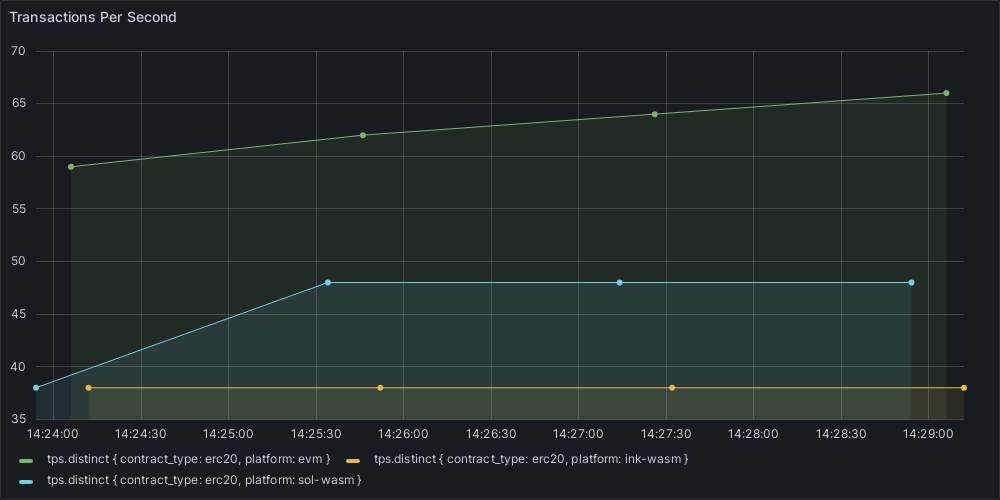

## Overview

This folder contains utilities to create visual graphs based on smart-bench measurements

Solution is based upon Grafana and InfluxDB software. 

### Theory of operation

1. Gather smart-bench benchmarking results in CSV format  
     Make use of an utility script `smart_bench_to_csv.sh`. Run it against smart-bench software multiple times to gather statistics data. Make sure to use meaningful timestamps. For example (any method to run smart-bench):

        ```
        cargo run --release -- evm flipper --instance-count 1 --call-count 1500 --url ws://localhost:9988 | ./smart_bench_to_csv.sh --csv-output=benchmark-result.csv --timestamp=1714515934

        cargo run --release -- ink-wasm flipper --instance-count 1 --call-count 1500 --url ws://localhost:9988 | ./smart_bench_to_csv.sh --csv-output=benchmark-result.csv --timestamp=1714515934

        cargo run --release -- sol-wasm flipper --instance-count 1 --call-count 1500 --url ws://localhost:9988 | ./smart_bench_to_csv.sh --csv-output=benchmark-result.csv --timestamp=1714515934
        ```

        or

        ```
        ../launch/run.sh -- evm flipper --instance-count 1 --call-count 1500 | ./smart_bench_to_csv.sh --csv-output=benchmark-result.csv --timestamp=1714515934

        ../launch/run.sh -- ink-wasm flipper --instance-count 1 --call-count 1500 | ./smart_bench_to_csv.sh --csv-output=benchmark-result.csv --timestamp=1714515934

        ../launch/run.sh -- sol-wasm flipper --instance-count 1 --call-count 1500 | ./smart_bench_to_csv.sh --csv-output=benchmark-result.csv --timestamp=1714515934
        ```

        above will create `benchmark-result.csv` file with all `3` results appended

    or get existing csv results from [gh-pages branch](https://github.com/paritytech/smart-bench/tree/gh-pages)
2. Make use of `get_graph.sh` to generate graph as PNG image
    - script is spinning up ephemeral environemnt with Grafana, Grafana Renderer and InfluxDB services running by utilizing docker-compose.yml configuration
    - translates benchmarking data provided in CSV format into Line Protocol format supported by InfluxDB, then uploads it to the InfluxDB service
    - script is downloading given Grafana panel id (see supported ids beloew) as PNG image by utlizing Grafana plugin pre-configured in the environemnt

### Currently supported panel ids with examples:
- `--panel-id=2` - panel to display transactions per seconds (TPS) measurements per platform, per contract type


## Usage
### `get_graph.sh` help screen:
```
Script to generate PNG graphs out of CSV formatted data from smart-bench via ephemeral Grafana+InfluxDB environment

Usage: ./get_graph.sh ARGS

ARGS
 -p, --panel-id       (Required) ID of the panel within Grafana dashboard to render as PNG
 -c, --csv-data       (Required) CSV formatted output of smart-bench
 -o, --output         (Required) Path to file where output PNG image will be stored
 -h, --help           Print this help message

EXAMPLE
./get_graph.sh --panel-id=2 --csv-data=benchmark-result.csv --output=tps.png
```

### `smart_bench_to_csv.sh` help screen:
```
Script to translate smart bench stdout data into csv formatted benchmarking results
Script expects data to be piped from smart-bench application into this script

Usage: smart-bench ..... | ./smart_bench_to_csv.sh ARGS

ARGS
 -o, --csv-output     (Required) CSV formatted output of smart-bench
 -t, --timestamp      (Optional) Timestamp to use for benchmark results - if not provided, current time is used
 -h, --help           Print this help message

EXAMPLE
smart-bench evm flipper --instance-count 1 --call-count 1500 --url ws://localhost:9988 | ./smart_bench_to_csv.sh --csv-output=benchmark-result.csv --timestamp=1714515934
```

